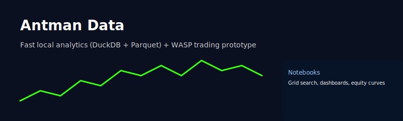

# Antman Data  

[](https://github.com/drewgoodman1/antman_data/actions/workflows/ci.yml)
[](https://www.python.org/)
[](https://github.com/drewgoodman1/antman_data)
[](/LICENSE)
[](https://github.com/drewgoodman1/antman_data/releases)

A compact research and data-engineering sandbox for market data and trading strategy prototyping.

---

<p align="center"></p>

## Why this repo

Antman Data combines fast, local analytics (DuckDB + Parquet) with a small, reproducible data lake (MinIO) and a live/paper trading agent (WASP). It’s designed for quick iteration: collect data, run parameter sweeps, validate on historical data, and run a scheduled live bot that mirrors backtest session filters.

## Highlights

- Local MinIO S3-compatible data lake (partitioned Parquet)
- DuckDB for fast SQL analytics over Parquet
- ETL scripts to ingest and transform market data
- WASP trading bot with Alpaca integration and systemd scheduler examples
- Jupyter notebooks for grid search, equity curves, and dashboards

---

## Table of contents

- [Quick start](#quick-start)
- [Usage examples](#usage-examples)
- [WASP trading bot](#wasp-trading-bot)
- [Scheduler & CI](#scheduler--ci)
- [Project structure](#project-structure)
- [Troubleshooting](#troubleshooting)
- [Business value](#business-value)

---

## Quick start

1. Clone and create a venv

```zsh
git clone https://github.com/drewgoodman1/antman_data.git
cd antman_data
python -m venv antman_env
source antman_env/bin/activate
pip install -r requirements_essential.txt -r requirements.txt
```

2. Copy env and configure credentials

```zsh
cp .env.example .env
# edit .env and set MINIO_*, S3_*, and ALPACA_* values
```

3. Start MinIO (local S3)

```zsh
docker compose up -d
# MinIO console: http://localhost:9101
```

4. Upload a sample day (Python helper)

```zsh
source antman_env/bin/activate
DAY=2025-01-02 python scripts/upload_spy_day_to_minio.py
```

5. Open notebooks

```zsh
code notebooks/minio_spy_dashboard.ipynb
# or open in JupyterLab / VS Code Notebook UI
```

---

## Usage examples

Query the data lake from Python (DuckDB + httpfs):

```python
import os, duckdb
con = duckdb.connect()
con.execute("INSTALL httpfs; LOAD httpfs;")
con.execute("SET s3_url_style='path';")
con.execute("SET s3_use_ssl='false';")
con.execute("SET s3_endpoint='127.0.0.1:9100';")
con.execute("SET s3_access_key_id=$1;", [os.getenv('MINIO_ROOT_USER','minioadmin')])
con.execute("SET s3_secret_access_key=$1;", [os.getenv('MINIO_ROOT_PASSWORD','minioadmin')])
print(con.execute("SELECT COUNT(*) FROM read_parquet('s3://%s/silver/symbol=SPY/resolution=1min/dt=2025-01-02/*.parquet')" % os.getenv('MINIO_BUCKET','antman-lake')).fetchone())
```

See notebooks for ready-made visualizations and interactive widgets.

---

## WASP trading bot

- Strategy: Fibonacci retracements + EMA/RSI filters + ATR volatility check.
- Live execution: Alpaca (paper/live) via `trading/wasp.py` and `scripts/run_wasp.sh`.
- Scheduling: systemd user/system timers provided as examples to align live windows with backtests.

Notes: trades and signals are logged as CSVs in `data/` by default. The repo intentionally stores only code and small sample data — large data artifacts are ignored (`*.csv` in `.gitignore`).

---

## Scheduler & CI

- A lightweight GitHub Actions workflow (`.github/workflows/ci.yml`) runs a smoke test and provides the repo badge above.
- Example systemd unit files are in repo notes and the repo includes helper scripts to run the WASP bot in a venv.

---

## Project structure

```
antman_data/
├── data/           # Bronze, silver, gold market data (gitignored)
├── dags/           # Airflow DAGs (optional)
├── notebooks/      # Jupyter research & dashboards
├── scripts/        # ETL, fetchers, uploaders, helpers
├── trading/        # WASP bot and strategy code
├── configs/        # SQL, dbt, and config files
├── requirements*.txt
└── README.md
```

---

## Troubleshooting

- MinIO console not reachable: verify ports in `.env` and use `docker compose ps`.
- DuckDB S3 errors: set `s3_endpoint='127.0.0.1:9100'` (no scheme) and `s3_url_style='path'`.
- Missing data: run `scripts/upload_spy_day_to_minio.py` for a quick sample.

---

## Business value

- Shortens research cycles for trading strategies.
- Keeps a reproducible local environment for demos and audits.
- Bridges engineering (Parquet/DuckDB) with live execution (Alpaca) for faster go/no-go decisions.

---

## Make it look extra-cool on GitHub

Follow these small, proven steps to give reviewers a crisp first impression:

- Add a demo GIF (preferred) or screenshot at `docs/assets/demo.gif` and embed it near the top of this README. Example embed (replace the SVG):

	<p align="center"></p>

- Badges: CI and license badges are already included. To add a release or coverage badge, use shields.io links. Example markdown for a release badge:

	```md
	[](https://github.com/drewgoodman1/antman_data/releases)
	```

- LICENSE: a `LICENSE` (MIT) was added to enable license badges and clarify reuse.

- CI: the GitHub Actions workflow was added. Merge this branch into `main` or create a PR to run the workflow and show the CI badge status.

If you want, I can:

- Produce a short demo GIF from an existing notebook output or a recorded dashboard clip.
- Add a `RELEASE` workflow to tag releases and publish a release badge.

---

## Contact

For demos or questions: goodman.drew1@gmail.com
